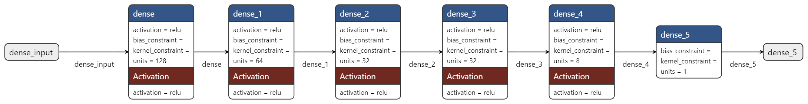

# Option Pricing Modeling and Analysis with Black-Scholes Equation and ANN 

**Exploring option pricing methodologies through a deep learning approach and comparing it with the classic Black-Scholes model.**

## Overview

This project delves into the realm of option pricing by combining the traditional Black-Scholes model with the power of artificial neural networks (ANNs). It aims to:

* Develop an ANN model for option price prediction.
* Conduct a comparative analysis between the ANN model and the Black-Scholes model.
* Construct a web application for practical price prediction.

## Key Components

### 1. Data Collection and Analysis

* **Dataset:**
    * Source: Yahoo Finance API
    * Number of records: 35,727
    * Features:
        * `contractSymbol` (object)
        * `lastTradeDate` (datetime64[ns])
        * `strike` (float64)
        * `lastPrice` (float64)
        * `impliedVolatility` (float64)
        * `expiry_date` (datetime64[ns])
        * `symbol` (object)
        * `dates diff` (int64)
        * `Stock price` (float64)
    * Memory usage: 2.5+ MB
    * Location: `Dataset` folder
    * Preprocessing and analysis details: `Data_collection_analysis` file
    * **Data description:**

   | Feature       | Count | Mean       | Std Dev    | Min        | 25%       | 50%       | 75%       | Max        |
   |----------------|-------|------------|------------|------------|-----------|-----------|-----------|------------|
   | strike         | 35727  | 163.558230 | 380.722103 | 0.350000   | 20.000000 | 50.000000 | 155.000000 | 5400.000000 |
   | lastPrice      | 35727  | 33.963996  | 100.049276 | 0.010000   | 0.440000   | 4.400000  | 20.150000  | 1499.750000 |
   | impliedVolatility | 35727  | 0.165873  | 0.697095  | 0.000000   | 0.000010   | 0.000010  | 0.125009  | 39.875004  |
   | dates diff     | 35727  | 187.674280 | 234.796544 | 2.000000   | 23.000000  | 65.000000  | 262.000000 | 967.000000 |
   | Stock price    | 35727  | 115.886382 | 135.571782 | 0.860300   | 19.219999 | 49.340000  | 148.839996 | 504.045685 |

   

       

           
            
           
<strong>Explanation:</strong> This histogram visualizes the distribution of option prices in the dataset

       

   
   

           
            
           
<strong>Explanation:</strong> This scatterplot visualizes the relation between option price and strike in the dataset

       

   
   

           
            
           
<strong>Explanation:</strong> This scatterplot visualizes the relation between option price and (stock price, time to expire) in the dataset

       

   

    
### 2. ANN Model Development Summary

**Key Highlights:**

- **Architecture:**
    - The model is a deep neural network with 5 dense layers.
    - The first layer has 128 neurons, followed by layers of 64, 32, 32, and 8 neurons.
    - All hidden layers use ReLU activation.
    - The output layer has a single neuron with linear activation for regression.
      

- **Training:**
    - The model was trained using the Adam optimizer and mean squared error (MSE) loss function.
    - Early stopping was implemented to halt training if validation loss didn't improve after 10 consecutive epochs.
    - The model was trained for a maximum of 1000 epochs with a batch size of 32.
    - 30% of the training data was used for validation.

- **Evaluation:**
    - the model shows 0.0208 loss on test data, train_loss: 0.0211, validation_loss: 0.0266
      

**For more detailed explanations and code, please refer to the following notebooks:**

- [notebook containing the modelling](Modelling_and_Results.ipynb)

### 3. Comparative Analysis

* **Table 1: Performance Metrics**

   | Metric         | BS Solution | AI Solution |
   |----------------|-------------|-------------|
   | Mean Squared Error | 7657.621653 | 123.939916 |
   | Mean Absolute Error | 313.412431 | 2.380170 |
   | Mean Absolute Percentage Error | 14.411696 | 5.983459 |

* **Plot:**

   

**4. Web Application**

* **Functionality:** Option price prediction
* **Code:** `web_app` folder
* **Instructions:** link to the app: [website](https://pdeprofiters.onrender.com/)

